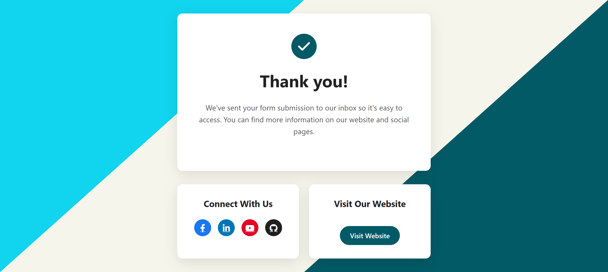
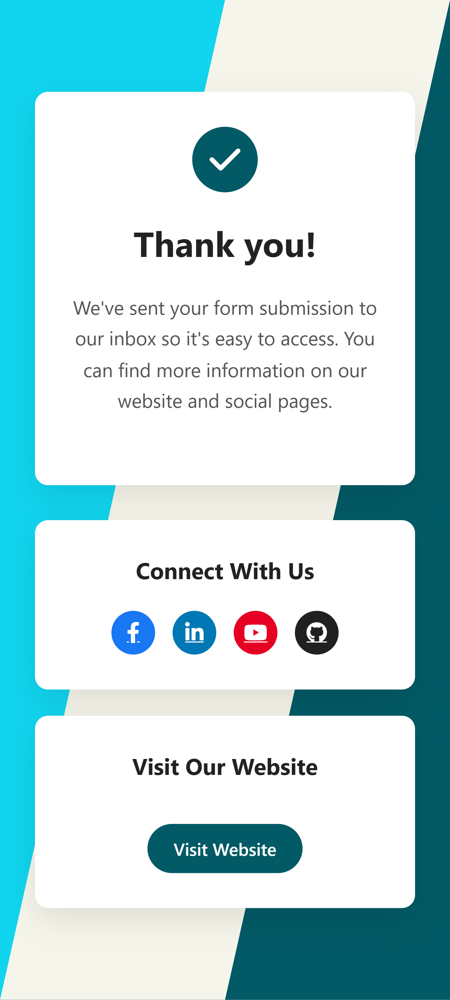

# thank-you-page
A beautiful, responsive thank you page for form submissions with modern design, diagonal sections, and social media integration.

## 🌟 Features
- **Responsive Design** - Fully optimized for desktop, tablet, and mobile devices.
- **Interactive UI** - Built with a sleek and engaging user interface.

## 🛠️ Tech Stack
- **HTML** - Structured and semantic markup.
- **CSS** - Modern styling with animations and transitions.

## 📸 Preview



## ⚡ How to Run
1. Clone the repository:
    ```bash
    git clone https://github.com/anjan-in/thank-you-page.git
    ```
2. Navigate to the project folder:
    ```bash
    cd thank-you-page
    ```
3. Open the `index.html` file in your browser.


## 📬 Contact
Feel free to reach out!
- LinkedIn: [linkedin.com/in/anjansen-tech/](https://www.linkedin.com/in/anjansen-tech/)

## 🧡 Credits
Made with ❤️ by **Anjan Sen**

## ⭐ Show Your Support
If you like this project, please consider giving it a star ⭐ and sharing it!

---
© 2025 Anjan Sen. All rights reserved.
